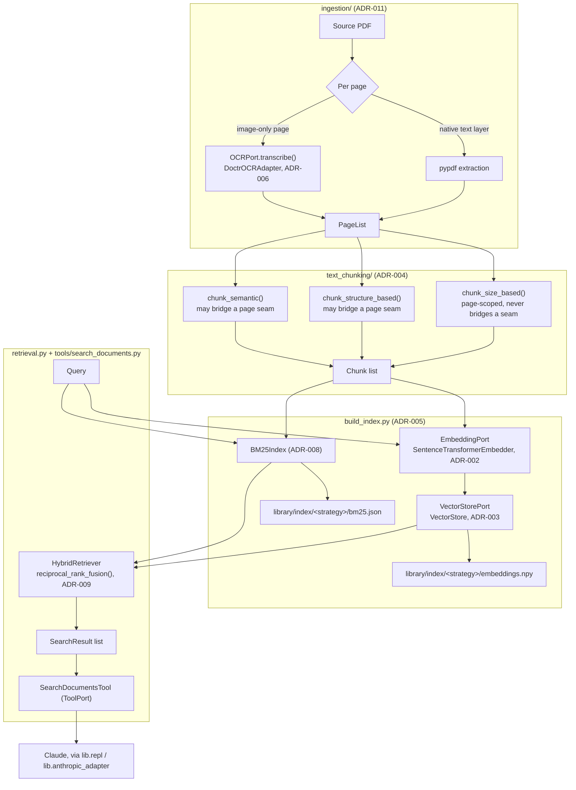
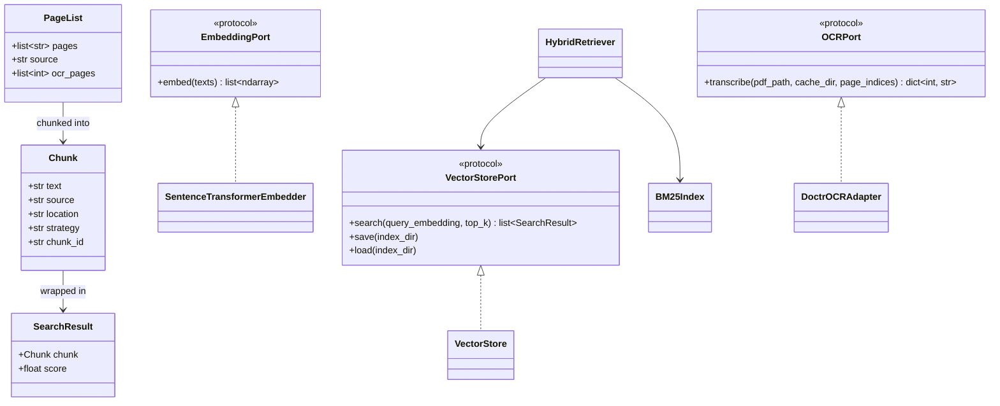

# RAG Architecture

Diagrams grounding the design recorded in [`adr/`](adr/). The ADRs are the
source of truth for *why*; this file is a visual index of *how the pieces
fit together*, kept in sync with them but not a duplicate of their prose.
See [`../README.md`](../README.md#staged-roadmap) for which numbered stage
builds which piece.

## Pipeline: source book to search result

## Core types and ports

## Notes

- `location` on `Chunk` is either a single page (`"page N"`) or, for
  structure-based/semantic chunks that bridge a page seam, a range
  (`"pages N-M"`) — see [ADR-004](adr/004-chunking-strategies-page-scoped.md).
- The ingestion pipeline has no Scan/PDF fork: a fully-scanned book is just
  the case where every page takes the OCR branch — see
  [ADR-011](adr/011-ingestion-unified-per-page-pipeline.md).
